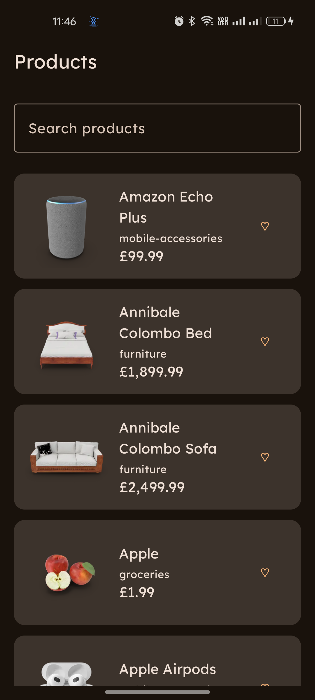
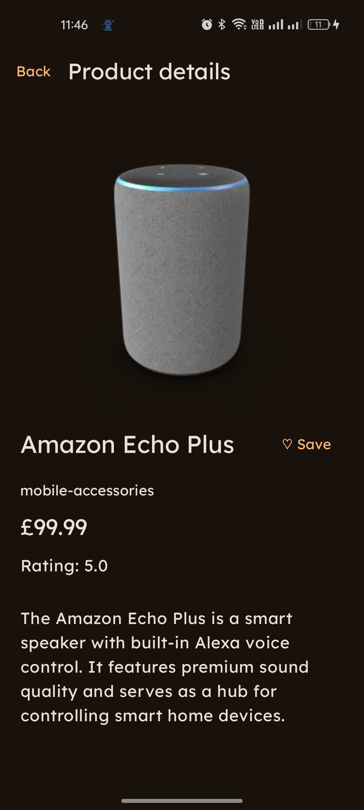

# Products

An offline-first Android product browser built with Kotlin and Jetpack Compose. The app fetches products from [DummyJSON](https://dummyjson.com/docs/products), caches them locally, and keeps the UI driven by Room.

I built this project to keep the scope small enough to understand end to end while still covering the decisions that matter in a real app: state ownership, local and remote data, dependency injection, navigation, and tests.

<p align="center">
  
  
</p>

## What it does

- Loads and caches a product catalog
- Searches by product name or category
- Saves favorites locally
- Opens product details using type-safe navigation
- Keeps cached content available when a refresh fails
- Supports pull-to-refresh and light/dark themes

## How it works

```text
Compose screen
    ↑ UiState (StateFlow)       ↓ user actions
ViewModel
    ↓
ProductRepository
    ├── Retrofit → DummyJSON
    └── Room → observed by the UI
```

Room is the single source of truth. A refresh writes the network result to the database inside a transaction, and the UI receives the update from Room's `Flow`. The refresh also carries forward locally saved favorite flags instead of overwriting them with remote data.

Screen state is exposed as immutable `StateFlow` and collected with lifecycle awareness. `SharedFlow` is limited to the refresh-failure snackbar because that message is transient; anything required to redraw a screen stays in `UiState`.

## Project layout

```text
data/
  local/       Room database, DAO, entity and local data source
  remote/      Retrofit service, DTO and remote data source
  repository/  Offline-first repository and model mapping
domain/
  model/       App model
  repository/  Repository contract
ui/
  products/    Product list screen and ViewModel
  details/     Product detail screen and ViewModel
  navigation/  Typed destinations
  theme/       Material theme and local Lexend typography
di/            Hilt bindings
```

The project stays in one Gradle module because the codebase is small. ViewModels depend on the repository contract rather than Room or Retrofit directly. There are no use-case classes yet: the current operations do not contain enough shared or complex business logic to justify another layer.

## Built with

- Kotlin, coroutines and Flow
- Jetpack Compose and Material 3
- ViewModel and `SavedStateHandle`
- Type-safe Navigation Compose
- Retrofit and Kotlinx Serialization
- Room
- Hilt
- Coil
- JUnit, kotlinx-coroutines-test, Turbine and Compose UI testing

Package name: `com.manoj.productsmvvm`

## Tests

Local JVM tests cover repository mapping, cached-data behavior, list filtering, screen state, transient errors, detail loading, favorites, and coroutine scheduling.

Instrumented tests use a real in-memory Room database and Compose test APIs to cover DAO behavior, favorite preservation during refresh, rendering, and product click handling.

```powershell
# Local tests
.\gradlew.bat testDebugUnitTest

# Room and Compose tests on an emulator or device
.\gradlew.bat connectedDebugAndroidTest

# Debug APK
.\gradlew.bat assembleDebug
```
